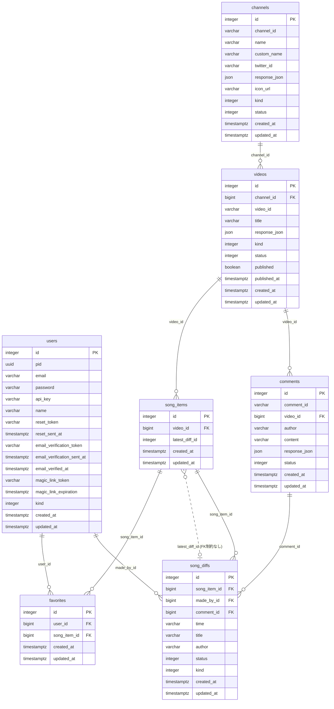

# テーブル定義

**参照元ファイル**:
- `migration/src/` 配下のマイグレーションファイル（スキーマの正）
  - `m20220101_000001_users.rs`
  - `m20260318_000001_add_kind_to_users.rs`
  - `m20260318_000002_create_channels.rs`
  - `m20260318_000003_create_videos.rs`
  - `m20260318_000004_create_comments.rs`
  - `m20260318_000005_create_song_items.rs`
  - `m20260318_000006_create_song_diffs.rs`
  - `m20260319_000007_create_favorites.rs`
  - `m20260328_022428_add_icon_url_to_channels.rs`
- `src/models/_entities/` 配下の SeaORM エンティティ（`sea-orm-codegen` 生成物・手動編集禁止）
- `src/models/` 配下のビジネスロジック層（Enum 定数・スコープ・ファインダ）

---

## 共通事項

- DB エンジン: **PostgreSQL**（開発は SQLite も可。`sea-orm` の `sqlx-postgres` / `sqlx-sqlite` 両フィーチャを有効化）
- マイグレーションは `loco_rs::schema` のヘルパ（`create_table` / `add_column` 等）で記述。SeaORM の `migration` クレート（`migration/`）に属し、`migration/src/lib.rs` の `Migrator` に登録する。
- 主キー `id` は `ColType::PkAuto`（`integer` の auto increment、`NOT NULL`）。エンティティ上の型は `i32`。
- 外部キー列（`channel_id` / `video_id` / `song_item_id` / `made_by_id` / `comment_id` / `user_id`）は `ColType::BigInteger`（`bigint`）。エンティティ上の型は `i64`。
- `create_table` ヘルパにより全テーブルへ `created_at` / `updated_at`（`timestamptz`・`NOT NULL`）が自動付与される。
- 論理削除は使用していない。関連レコードの削除はアプリケーション側で明示的に実施する（例: `song_items` 削除時に `latest_diff_id` を NULL 化してから `song_diffs` を削除）。
- `response_json` カラムは YouTube / 各 API のレスポンス断片を保存する。エンティティでは `#[serde(skip)]` 指定で API レスポンスには出力しない。
- 開発環境では起動時に自動マイグレーション（`database.auto_migrate: true`）。

---

## テーブル一覧

- [users](#users)
- [channels](#channels)
- [videos](#videos)
- [comments](#comments)
- [song_items](#song_items)
- [song_diffs](#song_diffs)
- [favorites](#favorites)

---

## users

ユーザーアカウント情報（Loco SaaS スターター由来 + `kind` 追加）。認証は JWT ベース。

| カラム名 | データ型 | NOT NULL | デフォルト値 | 備考 |
|---|---|---|---|---|
| id | integer | ✓ | auto increment | PK |
| pid | uuid | ✓ | - | JWT の subject。`before_save` で挿入時に採番 |
| email | varchar | ✓ | - | unique |
| password | varchar | ✓ | - | Argon2 ハッシュ（`loco_rs::hash`） |
| api_key | varchar | ✓ | - | unique。`before_save` で `lo-<uuid>` を採番 |
| name | varchar | ✓ | - | ログイン識別子として使用 |
| reset_token | varchar | - | - | パスワードリセット用 |
| reset_sent_at | timestamptz | - | - | |
| email_verification_token | varchar | - | - | |
| email_verification_sent_at | timestamptz | - | - | |
| email_verified_at | timestamptz | - | - | NULL なら未認証 |
| magic_link_token | varchar | - | - | マジックリンク認証用（32文字） |
| magic_link_expiration | timestamptz | - | - | 発行から5分 |
| kind | integer | ✓ | `0` | 権限区分 |
| created_at | timestamptz | ✓ | - | |
| updated_at | timestamptz | ✓ | - | |

**Enum `kind`**（`src/controllers/admin/mod.rs` / フロントエンド `resources/enums.ts`）:

| 値 | 名前 | 説明 |
|----|------|------|
| 0 | member | 一般ユーザー |
| 5 | banned | BAN ユーザー（フロントエンド enum に定義。バックエンドでの参照はなし） |
| 10 | admin | 管理者（`/api/admin/*` へアクセス可） |

**インデックス**:
- `email` (unique)
- `api_key` (unique)

---

## channels

YouTube チャンネル情報。

| カラム名 | データ型 | NOT NULL | デフォルト値 | 備考 |
|---|---|---|---|---|
| id | integer | ✓ | auto increment | PK |
| channel_id | varchar | ✓ | - | unique。YouTube のチャンネル ID（`UC...`） |
| name | varchar | - | - | YouTube 上のチャンネル名 |
| custom_name | varchar | ✓ | `''` | サイト表示名。動画一括登録の突合キー |
| twitter_id | varchar | - | - | |
| response_json | json | - | - | |
| icon_url | varchar | - | - | チャンネルアイコン URL（`m20260328` で追加） |
| kind | integer | ✓ | `0` | 公開区分 |
| status | integer | ✓ | `0` | |
| created_at | timestamptz | ✓ | - | |
| updated_at | timestamptz | ✓ | - | |

**Enum `kind`**（`src/models/channels.rs`）:

| 値 | 名前 | 説明 |
|----|------|------|
| 0 | hidden | 非公開（`/api/channels` に出さない） |
| 100 | published | 公開中 |

**Enum `status`**（`src/models/channels.rs`）:

| 値 | 名前 | 説明 |
|----|------|------|
| 0 | ready | 初期状態（`STATUS_READY`。現状これ以外の値は書き込まれない） |

**インデックス**:
- `channel_id` (unique)

---

## videos

YouTube 動画・ライブ配信情報。

| カラム名 | データ型 | NOT NULL | デフォルト値 | 備考 |
|---|---|---|---|---|
| id | integer | ✓ | auto increment | PK |
| channel_id | bigint | ✓ | - | FK → `channels.id` |
| video_id | varchar | ✓ | - | unique。YouTube の動画 ID |
| title | varchar | ✓ | - | |
| response_json | json | ✓ | - | RSS 取り込み時は `published_at` の採用元を記録した診断 JSON |
| kind | integer | ✓ | `0` | 現状の取り込み処理では常に `0`（ショートは取り込み時に除外） |
| status | integer | ✓ | `0` | 処理進捗 |
| published | boolean | ✓ | `true` | 公開フラグ。**新規作成時はコード側で `false` を設定** |
| published_at | timestamptz | ✓ | - | ライブは `actualStartTime`、それ以外は RSS の `<published>` |
| created_at | timestamptz | ✓ | - | |
| updated_at | timestamptz | ✓ | - | |

**Enum `kind`**（フロントエンド `resources/enums.ts` の `VideoKind`。バックエンドに名前付き定数なし）:

| 値 | 名前 |
|----|------|
| 0 | video |
| 10 | live |
| 20 | short |

**Enum `status`**（`src/models/videos.rs`）:

| 値 | 名前 | 説明 |
|----|------|------|
| 0 | ready | 初期状態 |
| 10 | fetched | 動画情報取得済み（`STATUS_FETCHED`） |
| 11 | comments_disabled | コメント無効のためセトリ処理をスキップ（`STATUS_COMMENTS_DISABLED`） |
| 20 | song_items_created | セトリ作成済み |
| 25 | fetched_history | 履歴からの author 補完済み |
| 30 | spotify_fetched | Spotify 検索実施（ヒットなし） |
| 35 | spotify_completed | Spotify で author 補完 |
| 40 | completed | 処理完了 |

**インデックス**:
- `video_id` (unique)
- `index_videos_on_channel_id`

**外部キー**:
- `channel_id` → `channels.id`

---

## comments

YouTube 動画のコメント（セトリ情報源）。

| カラム名 | データ型 | NOT NULL | デフォルト値 | 備考 |
|---|---|---|---|---|
| id | integer | ✓ | auto increment | PK |
| comment_id | varchar | ✓ | - | unique。YouTube のコメント ID |
| video_id | bigint | ✓ | - | FK → `videos.id` |
| author | varchar | ✓ | - | |
| content | varchar | ✓ | - | コメント本文 |
| response_json | json | ✓ | - | |
| status | integer | ✓ | `0` | |
| created_at | timestamptz | ✓ | - | |
| updated_at | timestamptz | ✓ | - | |

**Enum `status`**（`src/models/comments.rs`）:

| 値 | 名前 | 説明 |
|----|------|------|
| 0 | ready | 初期状態 |
| 10 | fetched | （定数は定義されているが現状未使用） |
| 20 | completed | セトリ抽出処理済み |

**インデックス**:
- `comment_id` (unique)
- `index_comments_on_video_id`

**外部キー**:
- `video_id` → `videos.id`

---

## song_items

セトリの各曲エントリ（コンテナ）。実データは `song_diffs` が持つ。

| カラム名 | データ型 | NOT NULL | デフォルト値 | 備考 |
|---|---|---|---|---|
| id | integer | ✓ | auto increment | PK |
| video_id | bigint | ✓ | - | FK → `videos.id` |
| latest_diff_id | integer | - | - | 最新の確定 `song_diffs.id` への非正規化参照。**DB 上の FK 制約はなし** |
| created_at | timestamptz | ✓ | - | |
| updated_at | timestamptz | ✓ | - | |

**インデックス**:
- `index_song_items_on_video_id`
- `index_song_items_on_latest_diff_id`

**外部キー**:
- `video_id` → `videos.id`

**スコープ（クエリ上の扱い）**:

| 名前 | 条件 | 用途 |
|-----|------|------|
| active | `latest_diff_id IS NOT NULL` | 確定済みの曲。`/api/song_items` は常にこの条件で絞込 |
| displayed | 上記 + `videos.published = true` | 公開ページで表示する曲 |

---

## song_diffs

セトリ曲情報の変更履歴（差分・修正提案）。

| カラム名 | データ型 | NOT NULL | デフォルト値 | 備考 |
|---|---|---|---|---|
| id | integer | ✓ | auto increment | PK |
| song_item_id | bigint | ✓ | - | FK → `song_items.id` |
| made_by_id | bigint | - | - | FK → `users.id`（nullable）。投稿ユーザー |
| comment_id | bigint | - | - | FK → `comments.id`（nullable）。AI 抽出元コメント |
| time | varchar | - | - | `HH:MM:SS` |
| title | varchar | - | - | 曲名 |
| author | varchar | - | - | アーティスト名 |
| status | integer | ✓ | `0` | 承認状態 |
| kind | integer | ✓ | `0` | 生成種別 |
| created_at | timestamptz | ✓ | - | |
| updated_at | timestamptz | ✓ | - | |

**Enum `status`**（`src/models/song_diffs.rs`）:

| 値 | 名前 | 説明 |
|----|------|------|
| 0 | pending | 承認待ち |
| 10 | approved | 承認済み（`song_item.latest_diff_id` を更新） |
| 20 | rejected | 却下 |

**Enum `kind`**（`src/models/song_diffs.rs`）:

| 値 | 名前 | 説明 |
|----|------|------|
| 0 | manual | 手動入力（管理画面 / 会員の修正提案） |
| 10 | auto | AI 自動抽出 |

**インデックス**:
- `index_song_diffs_on_song_item_id`
- `index_song_diffs_on_made_by_id`
- `index_song_diffs_on_comment_id`

**外部キー**:
- `song_item_id` → `song_items.id`
- `made_by_id` → `users.id`（nullable）
- `comment_id` → `comments.id`（nullable）

---

## favorites

ユーザーのお気に入り曲（`m20260319_000007` で追加）。

| カラム名 | データ型 | NOT NULL | デフォルト値 | 備考 |
|---|---|---|---|---|
| id | integer | ✓ | auto increment | PK |
| user_id | bigint | ✓ | - | FK → `users.id` |
| song_item_id | bigint | ✓ | - | FK → `song_items.id` |
| created_at | timestamptz | ✓ | - | |
| updated_at | timestamptz | ✓ | - | |

**インデックス**:
- `index_favorites_on_user_id`
- `index_favorites_on_user_id_and_song_item_id` (unique・複合)

**外部キー**:
- `user_id` → `users.id`
- `song_item_id` → `song_items.id`

---

## ER図（リレーション）



**外部キー制約まとめ**:
```
videos.channel_id       → channels.id
comments.video_id       → videos.id
song_items.video_id     → videos.id
song_diffs.song_item_id → song_items.id
song_diffs.made_by_id   → users.id      (nullable)
song_diffs.comment_id   → comments.id   (nullable)
favorites.user_id       → users.id
favorites.song_item_id  → song_items.id
```

`song_items.latest_diff_id` は `song_diffs.id` を指すが DB 上の FK 制約は張られていない。

---

## 備考

- `song_items.latest_diff_id` は最新の確定差分への非正規化参照。NULL の曲は未確定として扱い、公開 API では返さない。
- `videos.response_json` は RSS 取り込み時に `{ "published_at_source", "actual_start_time", "rss_published" }` を格納する（`src/workers/song_items_creator.rs` の `build_published_at`）。管理画面から個別登録した動画は YouTube API の `snippet` を格納する。
- テスト用のシードデータは `src/fixtures/users.yaml`（`user1` / `user2`、いずれも `kind = 0`）。
